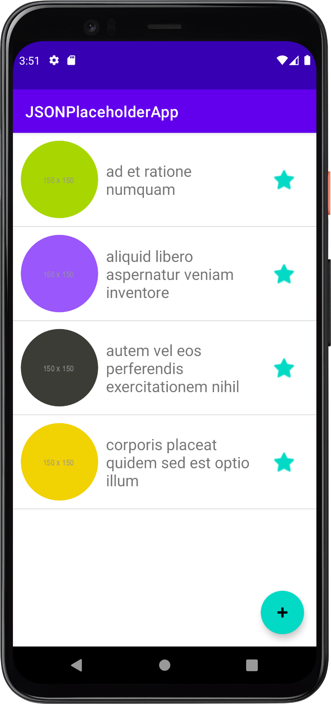

# JSONPlaceholder App

This app provides a detailed demo of an app with the following features:
- It connects to the JSONPlaceholder API [https://jsonplaceholder.typicode.com/](https://jsonplaceholder.typicode.com)
  using [Volley](https://developer.android.com/training/volley) and fetches data, parses it,
  stores it locally (enabling full offline use), and displays it.
- It uses [Glide](https://github.com/bumptech/glide) to dynamically fetch and display images in a list
- It uses [Room database](https://developer.android.com/training/data-storage/room) to persist data on the device
- It demonstrates the use of [RecyclerView](https://developer.android.com/guide/topics/ui/layout/recyclerview)
  and a custom [RecyclerView.Adapter](https://developer.android.com/guide/topics/ui/layout/recyclerview#implement-adapter) to display photos
- It allows the user to mark photos as favorite/favorite, properly updating the list view and the underlying Room database
- Demonstrates how to use [Snackbar](https://developer.android.com/training/snackbar/showing) to display a message, including an `Undo` action

All classes are properly commented to assist in understanding the code:
* Model classes
  * [Album](app/src/main/java/com/aspectsense/jsonplaceholderapp/Album.java)
  * Photo
* Room database classes
  * AppDao
  * AppDatabase
* UI classes
  * MainActivity: starting point, displays all the photos marked as favorite, initially empty
  * AlbumsActivity: uses a simple implementation of a ListView to display all available albums
  * PhotosActivity: uses a more elaborate implementation of RecyclerView to show a custom view for each photo, enabling marking them as favorite/not favorite
  * PhotosRecyclerAdapter: defines a custom implementation of an adapter for displaying the custom view of the photos, while realizing a listener interface for updating observers via callbacks

